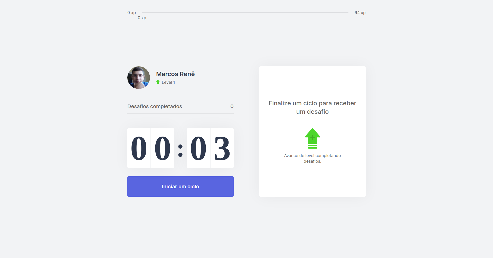

# Move.it

<p align="center">
   
   
   
</p>

### :computer: Descrição
Move.it foi desenvolvida na Next Level Week 04, ministrada pela rocketseat. Objetivo da plataforma é fazer com que as pessoas que passam muito tempo na frente do computador, possam executar execícios.

<p align="center">
   
</p>

### :hammer: Tecnologia Utilizada
* [React][reactjs]
* [Next.js][nextjs]
* [Context Api][contextapi]

### :rocket: Execução

```bash

# Clone este repositório.
$ git clone https://github.com/MarcosRene/next-level-week-04

# Entre na pasta do repositório.
$ cd clone-spotify

# Instalar dependências.
$ npm install || yarn install

# Executar aplicação.
$ npm start || yarn start

# executando na porta 3000

```

[reactjs]: https://reactjs.org/
[nextjs]: https://nextjs.org/
[contextapi]: https://pt-br.reactjs.org/docs/context.html
